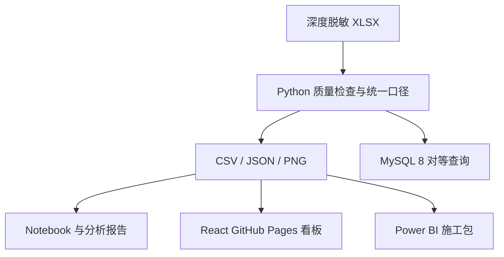
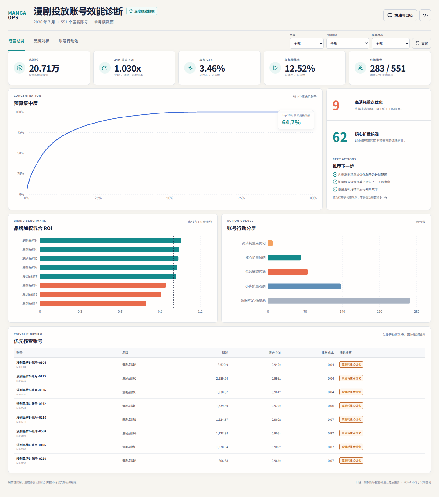

# 漫剧投放账号效能诊断与预算分层

一个可复现、可审计、可部署到 GitHub Pages 的数据运营作品集。项目基于 **2026 年 7 月、551 个匿名账号、8 个匿名品牌**的账号月度样本，使用 SQL、Python、Excel、React 和 Power BI 构建包回答：预算集中在哪里、规模与回收是否匹配、哪些账号适合扩量、优化、清理或继续积累样本。

> 诚信边界：这是基于实习场景主动发起的个人分析项目，不是公司正式上线系统；数据经过匿名替换与同比例缩放，绝对金额只用于数据集内相对比较；单月账号数据不能支持趋势、素材归因或因果结论。

## 一页结论

- 总消耗 **207,057.29**，24H 混合变现 **213,266.26**，加权 24H 混合 ROI **1.03**。
- 消耗 ≥ 50 的有效账号为 **283 / 551**，覆盖 **99.43%** 消耗；低量账号很多，但对总体消耗影响很小。
- 按账号数向下取整的 Top 10%（55 个）贡献 **64.74%** 消耗，预算集中度较高，应优先管理头部账号。
- 行动池为：核心扩量候选 **62**、高消耗重点优化 **9**、小步扩量观察 **137**、低效清理候选 **75**、数据不足/低量池 **268**。
- 品牌 C 占 **48.19%** 消耗、加权 ROI **1.04**；品牌 D/G 分别占 **19.22% / 18.54%** 消耗，ROI 均略高于 1。品牌 B/E 的加权 ROI 分别为 **0.94 / 0.91**，适合进入假设排查而非直接判定原因。
- 在有效样本内，CTR、CPC、播放率与 ROI 的 Spearman 相关绝对值均低于 0.04；重算播放成本与 ROI 为 **-0.128**。这些是弱关联，只能帮助排序待验证问题。

## 数据质量发现

源表 551 行、22 个字段，无缺失、无重复账号月键、无负数、无点击或播放超过展示的异常。关键审计问题是：源字段“播放成本”在 534 个有消耗账号中实际等于 **播放量 ÷ 消耗**，与通常的成本口径方向相反；469 个有播放账号不满足“消耗 ÷ 播放量”。因此所有分析统一使用：

```text
重算播放成本 = SUM(平台投放总消耗) / SUM(播放量)
```

原字段仅保留用于审计，不参与成本结论。

## 方法与分层规则

品牌及全局比率均“先汇总基础量、再相除”，禁止平均账号级比率：

| 指标 | 统一口径 |
|---|---|
| 加权 CTR | 总点击 ÷ 总展示 |
| 加权 CPC | 总消耗 ÷ 总点击 |
| 加权 CPM | 总消耗 × 1000 ÷ 总展示 |
| 加权播放率 | 总播放 ÷ 总展示 |
| 重算播放成本 | 总消耗 ÷ 总播放 |
| 24H 混合 ROI | 24H 混合变现 ÷ 总消耗 |

分层先设消耗门槛 50，再在 283 个有效账号中计算消耗 P75 = **735.80**；ROI 参考线为 1.0。

| 行动标签 | 规则 | 建议动作 |
|---|---|---|
| 核心扩量候选 | 有效、高消耗、ROI ≥ 1 | 小幅增加预算上限，2–3 天观察回收稳定性 |
| 高消耗重点优化 | 有效、高消耗、ROI < 1 | 优先排查素材、计划配置与承接链路 |
| 小步扩量观察 | 有效、非高消耗、ROI ≥ 1 | 小步验证增量，保留止损与观察窗 |
| 低效清理候选 | 有效、非高消耗、ROI < 1 | 复核后降级或暂停，避免机械清理 |
| 数据不足/低量池 | 消耗 < 50 | 补样本或保留测试，不做稳定性判断 |

ROI=1 只表示本口径下 24H 混合变现覆盖投放消耗，不等于公司利润。

## 技术架构



Python 包是业务逻辑的唯一事实来源；SQL 使用同一套字段、门槛和公式；网页只读取预计算的匿名 JSON，不需要后端。

## 快速复现

### 1. Python 管道

```bash
python -m venv .venv
source .venv/bin/activate          # Windows PowerShell: .venv\Scripts\Activate.ps1
python -m pip install --upgrade pip
pip install -e ".[dev]"
python scripts/run_pipeline.py
python scripts/build_notebooks.py
python scripts/execute_notebooks.py
python -m unittest discover -s tests -v
```

成功时 `outputs/pipeline_receipt.json` 的 `all_reconciliations_passed` 为 `true`。

### 2. 本地看板

```bash
cd web
npm ci
npm test
npm run dev
```

浏览器打开终端显示的本地地址。生产构建使用 `npm run build`；Vite 已使用相对资源路径，支持 GitHub 仓库子路径。

### 3. SQL

在 MySQL 8 依次运行 `sql/01_create_table.sql` 至 `sql/05_account_segmentation.sql`。先把公开 CSV 导入 `manga_ad_account_monthly`，再用质量、品牌、Pareto 和分层查询与 Python 输出对账。详细操作见 [GitHub 与本地部署说明](docs/github_deployment.md) 和随附实操手册。

### 4. Power BI

项目不提供伪造 PBIX。请在 Windows Power BI Desktop 中按 [Power BI 施工说明](powerbi/README_powerbi.md) 导入公开分层 CSV、复制 Power Query/DAX、加载主题并构建三页报告。

## 看板预览



仓库压缩包为保持整洁不会包含本地 QA 过程文件；验证方法与通过项记录在 `VALIDATION.md`。

## 目录

```text
.
├── data/processed/        # 深度脱敏源表与可复现派生 CSV
├── docs/                  # 数据字典、分析报告、面试与部署说明
├── images/                # Python 生成的静态图
├── notebooks/             # 已执行的数据质量与账号诊断 Notebook
├── outputs/               # 管道运行回执
├── powerbi/               # DAX、Power Query、主题与构建清单
├── scripts/               # 管道与 Notebook 入口
├── sql/                   # MySQL 8 建表、质量、品牌、Pareto、分层查询
├── src/                   # 可测试的 Python 分析包
├── tests/                 # 数据契约、逻辑、输出与交付测试
├── tools/                 # 数据字典与网页视觉 QA 工具
└── web/                   # React / Vite / Recharts 静态看板
```

## 主要交付物

- [数据字典](docs/data_dictionary.xlsx)：字段、口径、数据源评估、质量检查、行动规则。
- [分析报告 PDF](docs/analysis_report.pdf)：答案优先的业务分析报告。
- [面试讲解指南](docs/interview_guide.md)：3 分钟项目陈述、追问与边界。
- [项目设计规格](docs/project_design.md)：数据边界、架构、交付范围与验收标准。
- [网页验证记录](VALIDATION.md)：功能、响应式、对账与设计保真证据。
- [Power BI 构建包](powerbi/README_powerbi.md)：可复制代码与验收清单。

## 限制与下一步

当前数据只有单月、账号粒度，无法区分素材、计划、人群、版位或时间因素，也无法验证策略收益。下一步若获得连续日级数据，应预注册观察窗与止损条件，跟踪新增预算的边际 ROI，并对品牌/素材/计划分层做小规模对照验证。

## 使用声明

项目仅用于学习、作品集展示与面试讲解。网页与 Power BI 消费层不包含客户字段；仓库源表及审计 CSV 中保留的客户字段也已深度脱敏，不含真实业务名称。不得据此推断真实客户、实际金额或公司经营结论。
